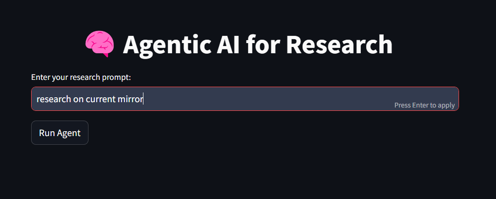
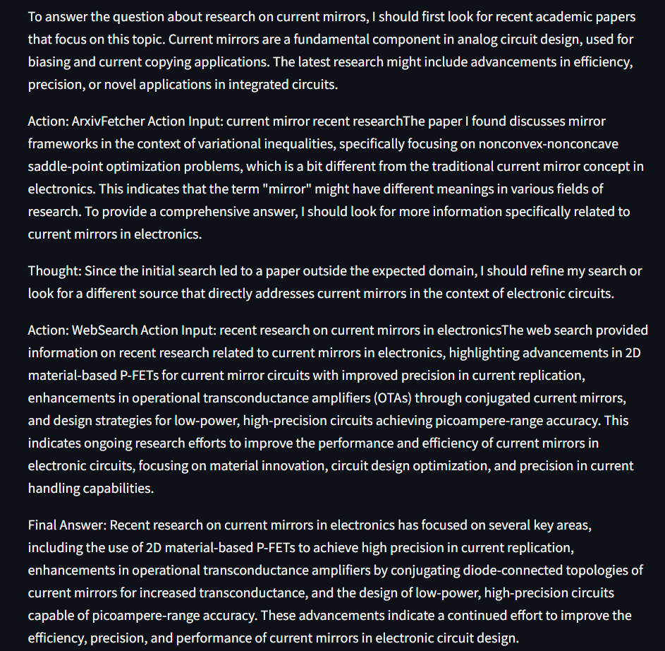
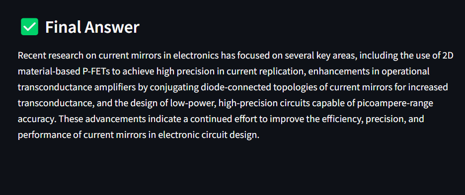

# 🧠 Agentic AI for Research

A Streamlit-based application that leverages LangChain agents and tools to assist with academic research tasks such as fetching papers from ArXiv, summarizing, technical explanation, and web searching — all integrated with real-time streaming outputs using OpenAI's GPT-4.

## 🔍 Features

- **ArXiv Fetcher**: Search and retrieve the most relevant research paper from ArXiv based on a query.
- **Summarizer**: Condense long academic content into digestible summaries using GPT-4.
- **Detailed Explainer**: Get technical insights, real-world applications, and deeper understanding of academic content.
- **Web Search**: Uses DuckDuckGo to provide contextual web-based insights.
- **QnA Extractor**: Extracts precise answers from long-form academic context.

## 🛠️ Tech Stack

- **[Streamlit](https://streamlit.io/)**: Interactive UI for real-time LLM interaction.
- **[LangChain](https://www.langchain.com/)**: Tool-based agent orchestration.
- **[OpenAI GPT-4](https://platform.openai.com/docs/models/gpt-4)**: Large language model for reasoning and content generation.
- **[ArXivLoader](https://python.langchain.com/docs/integrations/document_loaders/arxiv)**: Fetches research papers directly from ArXiv.
- **[DuckDuckGoSearchAPIWrapper](https://python.langchain.com/docs/integrations/tools/ddg_search)**: Privacy-friendly search tool integration.

## 🚀 How to Run

1. **Clone the repository**

   ```bash
   git clone https://github.com/anweshaprakash/agenticAI-researcher.git
   cd agenticAI-researcher
   ```

2. **Install dependencies**

   It's recommended to use a virtual environment.

   ```bash
   pip install -r requirements.txt
   ```

3. **Set up environment variables**

   Add your OpenAI API key (and optionally other credentials) to a `.env` file:

   ```env
   OPENAI_API_KEY=your-openai-key
   ```

4. **Run the Streamlit app**

   ```bash
   streamlit run agent.py
   ```

## 📁 Project Structure

```
.
├── app.py                  # Main Streamlit application
├── requirements.txt        # Python dependencies
├── assets/                 # Screenshots and images
└── README.md               # Project documentation
```

## 🧪 Example Use Case

**Prompt**:
> "Explain the latest advancements in quantum error correction."

**Output**:
- Fetches top relevant paper from ArXiv.
- Summarizes the abstract and key findings.
- Provides a detailed technical breakdown.
- Searches DuckDuckGo for recent updates and blog posts.
- Answers any follow-up question asked by the user.

## 📸 Screenshots

| Prompt Input | Streaming Response | Final Answer |
|--------------|--------------------|---------------|
|  |  |  |

## 🙋‍♀️ Author

Developed by [Anwesha Prakash](https://github.com/yourusername) as part of a GenAI use-case exploration.

## 📄 License

This project is open-source and available under the [MIT License](LICENSE).

---

✨ Contributions are welcome! Feel free to fork, improve, and submit PRs.
